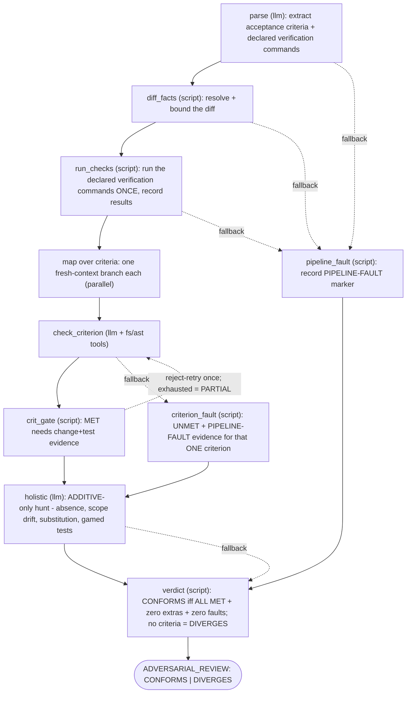

# Adversary

> [!IMPORTANT]
> **v2: now a GRAPH agent.** The plan's acceptance criteria are extracted into a list and the graph
> fans out ONE fresh-context verification branch per criterion — partial coverage ("checked 8 of 12")
> is structurally impossible. Each verdict passes a deterministic contract gate (MET requires
> evidence including a proving test; no test = at best PARTIAL), a holistic ADDITIVE-only pass hunts
> absence/scope-drift/substitution/gamed-tests, and the CONFORMS/DIVERGES sentinel is computed by a
> script (missing plan = DIVERGES, fail-closed). The conformance doctrine below is unchanged — now
> structurally enforced.


An **adversarial plan-conformance reviewer**. Where [`code-reviewer`](../code-reviewer/README.md)
asks *"is this code good?"*, `adversary` asks a different, harder question:

> **"Is this the code the plan asked for — all of it, and only it?"**

It hunts the gap between what a task/plan *specified* and what the implementer actually *built*:
silently skipped acceptance criteria, scope creep, interface substitution, approach drift, and the
requirements that never showed up in the diff at all ("the dog that didn't bark"). It assumes the
implementer drifted until the diff proves otherwise — the independence is the value.

## Why it's separate from `code-reviewer`

| | `code-reviewer` | `adversary` |
|---|---|---|
| Question | Is the code correct/clean/safe? | Does the code match the plan? |
| Input | The diff | The diff **+ the plan's acceptance criteria** |
| Blind spot it covers | slop, bugs, coupling, footguns | skipped criteria, scope drift, contract breakage |
| Output | severity-tagged findings (🔴🟡🟢) | a blocking verdict: `CONFORMS` / `DIVERGES` |

They are **complementary passes**, not substitutes. `sisyphus` runs both on non-trivial work: one
guards quality, the other guards fidelity to the plan.

## Verdict (blocking)

The agent ends every review with one sentinel:

```
ADVERSARIAL_REVIEW: CONFORMS
Criteria: N/N met (all with tests).
```

```
ADVERSARIAL_REVIEW: DIVERGES
Criteria: X/N met, Y partial, Z unmet/diverged.
Complaints:
1. Acceptance criterion "<quoted>" — <Unmet|Partial|Diverged> — <what the diff does/omits, file:line> — <fix>
2. ...
```

Every verdict — CONFORMS or DIVERGES — ends with a `Verification runs:` section: the recorded
PASS/FAIL results (command, exit code, duration, failure tail) of the caller-declared verification
commands, or an explicit marker when none were declared or the run never reached that stage. The
one exception is the verdict script's own crash guard, which emits a bare DIVERGES with a
"verdict computation error" line — and no section — when verdict computation itself dies.

A `DIVERGES` verdict **blocks** completion. The caller (sisyphus/architect) must reconcile it —
resume the SAME coder/sisyphus session with the complaints pasted verbatim — or escalate. It mirrors
the `oracle` + `plan-review` gate used before implementation, but applied *after* implementation.

Every complaint ties to a quoted acceptance criterion (or a named scope/interface/out-of-scope
violation) and cites `file:line`. Vague complaints are not emitted.

## How it reviews



The conformance doctrine is baked into the graph's own nodes:

1. **Every** acceptance criterion gets its own fresh-context verification branch — MET / PARTIAL / UNMET / DIVERGED, machine-gated (MET requires the satisfying change AND the proving test, cited). No test ⇒ at best PARTIAL. Partial coverage of the criteria list is structurally impossible.
2. Ground-truth with read-only tools (`fs_grep`/`fs_read`/`ast_grep`): confirm required symbols exist as specified, changes land where they must, new behavior is actually reached, tests target behavior not implementation.
3. Execution evidence is recorded **once, deterministically**: `run_checks` runs ONLY the caller-declared verification commands (never invented or auto-detected), sequentially under a 3300s total deadline — commands the deadline leaves no budget for are recorded as SKIPPED. Criterion branches have no execution tools by design: "tests pass"-style criteria are judged against the record — a recorded green run is MET citing it; no declared command ⇒ at best PARTIAL.
4. Hunt adversarially for the **absent**: skipped criteria, scope creep, interface/approach substitution, out-of-scope touches, downstream contract breakage.
5. **Fail closed on pipeline faults**: if parse, diff resolution, or the verification runner dies, its fallback routes to `pipeline_fault`, which records a `PIPELINE-FAULT:` marker and continues to the verdict (a failed holistic pass falls back straight to the verdict, which synthesizes the same marker). Any recorded fault forces DIVERGES with the fault as complaint #1 — degraded is never passing, and the sentinel is always emitted: the graph never dies without one.
6. **Fail closed per criterion**: a criterion check that dies (max_iterations exhausted, API failure) falls back to `criterion_fault`, which records a schema-shaped UNMET verdict carrying a `PIPELINE-FAULT:` evidence marker for that one criterion. The other criteria still get verdicts, the report says the check DIED rather than judged, and the run is DIVERGES. The evidence marker alone forces the criterion into unmet regardless of the status it carries, so a verdict that echoes the marker with `MET` can never count toward CONFORMS.

It is **read-only** — it produces a verdict, never a fix.

## Usage

Typically spawned by `sisyphus` (or `architect`) alongside `code-reviewer`. The spawn prompt IS its
entire context, so it must include the diff (or a base ref to fetch) **and** the acceptance criteria:

```sh
agent__spawn --agent adversary --prompt "
## TASK
Adversarially review the recent changes for TASK-NNN against its plan. Return CONFORMS/DIVERGES.

## DIFF
Run get_diff (or --base main), or: <paste diff>

## PLAN — acceptance criteria to check against
<paste the task index.md body + the relevant PLAN-*.md section, verbatim>

## VERIFICATION (optional)
<exact build/test/lint commands to run, one per line — undeclared commands are never guessed>
"
```

Direct invocation for ad-hoc use:

```sh
coyote -a adversary --agent-variable project_dir /path/to/repo \
  "Review staged changes against these criteria: <paste criteria>"
```

### Tools

- The graph's `diff_facts` script resolves the diff itself (staged → unstaged → `HEAD~1`, or an explicit ref/range named in the prompt) — there is no `get_diff` tool anymore.
- The `run_checks` script executes the caller-declared verification commands and records the results — criterion branches cite the record and never run anything themselves.
- Criterion branches carry read-only `fs_read`/`fs_cat`/`fs_grep`/`ast_grep` for ground-truth checks.

## Related

- [`code-reviewer`](../code-reviewer/README.md) — the quality reviewer it runs alongside.
- [`plan-review`](../../skills/plan-review/SKILL.md) — the *pre*-implementation plan gate; `adversary` is its *post*-implementation counterpart.
