# Architect

A **design-doc orchestrator for any project**. Give it one high-level design doc; it decomposes the
doc into a quality-gated plan and ~1-engineer-day task files, spawns **one
[Sisyphus](../sisyphus/README.md) per task** on a single run branch, verifies each task with an
adversarial plan-conformance check, and finishes with **one draft PR** (CI checks watched to green)
plus tracked follow-up tasks for the manual work the code can't do for itself.

Architect does **not** write feature code itself. It owns the *process*; Sisyphus owns each *task*.

## The pipeline it drives

```mermaid
flowchart TD
    user([Design doc]) --> architect["Architect<br/>design-doc orchestrator"]
    architect --> orient["Phase A — Orient<br/>project conventions · build/test commands · design doc"]
    orient --> design["Phase B — design-session<br/>plans_dir/PLAN-&lt;slug&gt;.md + 1-day task breakdown"]

    design -. "grounding" .-> explore[["explore<br/>codebase grep<br/>× parallel"]]
    design -. "unfamiliar libraries" .-> librarian[["librarian<br/>docs + OSS grep"]]
    explore -. "findings ground<br/>the breakdown" .-> design
    librarian -. "findings ground<br/>the breakdown" .-> design

    design --> gatekeeper[["gatekeeper<br/>self-containedness audit<br/>(docker-container test)"]]
    gatekeeper --> g1{"PLAN_GATE?"}
    g1 -->|"LEAKY (≤ 2 cycles)"| amend["Answer the missing questions<br/>via explore / librarian / docs<br/>(user__ask only for business rules)<br/>→ amend the plan"]
    amend --> gatekeeper
    g1 -->|"LEAKY after 2 cycles"| escalate
    g1 -->|"SEALED"| oracle[["oracle<br/>plan-review<br/>(executability)"]]

    oracle --> g2{"PLAN_REVIEW?"}
    g2 -->|"REJECT — fix complaints,<br/>re-submit SAME session"| oracle
    g2 -->|"OKAY"| tasks["Phase D — materialize tasks<br/>plans_dir/tasks/TASK-NNN-*/ (task-tracking)"]

    tasks --> branch["Phase E — run branch<br/>feat/PLAN-&lt;slug&gt; off base_branch"]
    branch --> claim["Claim task (sequential, dependency order)<br/>status: in-progress + base SHA"]
    claim --> sisyphus[["sisyphus<br/>implement ONE task on the run branch<br/>commit + push — NO PR"]]
    sisyphus --> adversary[["adversary<br/>conformance check<br/>diff vs task base SHA"]]

    adversary --> verdict{"ADVERSARIAL_REVIEW?"}
    verdict -->|"DIVERGES — resume<br/>SAME sisyphus session (once)"| sisyphus
    verdict -->|"still DIVERGES"| escalate
    verdict -->|"CONFORMS"| taskdone["Close task<br/>status: complete · log commits + follow-ups"]

    taskdone --> more{"More tasks?"}
    more -->|"yes"| claim
    more -->|"no"| finish["Phase F — full build + tests<br/>on the integrated run branch"]

    finish --> pr["ONE DRAFT PR: run branch → base_branch<br/>(never marked ready — user reviews first)<br/>body: task checklist + Follow-up / manual actions"]
    pr --> checks{"PR runs/checks<br/>green?"}
    checks -->|"failure — resume responsible<br/>sisyphus session, fix, push"| checks
    checks -->|"external flake /<br/>broken base branch"| escalate
    checks -->|"green"| followups["Create follow-up task files<br/>(type: followup, pending)<br/>→ picked up by the user post-merge"]
    followups --> backfill["Backfill PR link into PLAN + task logs<br/>PLAN status: implemented"]
    backfill --> validate["task-tracking consistency checks"]
    validate --> done([Run complete])

    escalate([user__ask — escalate to user])

    branch -. "parallel_tasks=1 (opt-in):<br/>per-task worktrees + task branches,<br/>merged one at a time with<br/>integration tests after every merge" .-> claim
```



## Where state lives

Everything is file-based in **`plans_dir`** (default `plans/`, resolved against the project):

```
<plans_dir>/
  PLAN-<slug>.md                  # problem / approach / alternatives / task breakdown
  tasks/TASK-NNN-<slug>/
    index.md                      # What / Steps / Acceptance criteria; status in frontmatter
    log.md                        # append-only audit trail (branch, commits, follow-ups, PR)
```

- `plans_dir` **inside the repo** (default) → planning files ride the run branch and land in the PR
  (self-documenting review).
- `plans_dir` **absolute, outside the repo** (e.g. a common runs directory) → nothing planning-related
  is ever committed.

Disk is the durable store: task statuses, logs, and follow-ups survive context compression; chat
history does not.

## The three review gates

| Gate | Agent | Question | When |
|------|-------|----------|------|
| Self-containedness | [`gatekeeper`](../gatekeeper/README.md) | "Can a context-free LLM implement from this plan alone?" | Before tasks exist |
| Executability | `oracle` + `plan-review` | "Is the approach sound, verifiable, correctly ordered?" | After sealing |
| Conformance | [`adversary`](../adversary/README.md) | "Is the built code what the plan asked for?" | After each task |

## Key conventions it enforces

- **One task = one engineer-day** — anything larger gets decomposed at the design stage.
- **Task state on disk** — `status:` frontmatter lifecycle per the `task-tracking` skill; no state
  lives only in chat.
- **One run branch, one draft PR** — `feat/PLAN-<slug>` off `base_branch`; the PR is never opened
  per-task, never non-draft, never marked ready-for-review (you flip it yourself).
- **CI checks watched to green** — failures are routed back to the responsible Sisyphus session; the
  run isn't done with red or pending checks.
- **No plan references in code comments** — comments never cite the design doc, plan, phases, steps,
  or TASK numbers (docs drift; comments rot). Plan references live in commit messages only.
- **`.env` never lands in a repo** — only `.env.example` with placeholder keys; real values become a
  follow-up.
- **Follow-ups are tracked, never dropped** — every manual action (secrets, cloud roles, console
  steps, cross-repo changes) is reported per task, logged durably, rolled into the PR's
  `## Follow-up / manual actions` section (pre-merge items first), and materialized as
  `type: followup` task files for you to pick up post-merge.

## Usage

```sh
# From the target project root (default autonomy: full)
coyote -a architect --agent-variable design_doc docs/design/my-feature.md \
  "Implement this design doc end to end"

# Approve the task breakdown once, then run autonomously
coyote -a architect \
  --agent-variable design_doc docs/design/my-feature.md \
  --agent-variable autonomy plan-gate \
  "Decompose and implement"

# Different project / plans outside the repo / PR against a non-main base
coyote -a architect \
  --agent-variable project_dir ~/code/my-service \
  --agent-variable plans_dir ~/architect-runs/my-service \
  --agent-variable base_branch develop \
  --agent-variable design_doc ~/docs/big-refactor.md \
  "Run the pipeline"
```

### Variables

| Variable | Default | Meaning |
|----------|---------|---------|
| `project_dir` | `.` | The target repo — the only WRITE target for feature code. |
| `plans_dir` | `plans` | Where PLAN + task files live. Relative → in-repo (rides the PR); absolute → outside git. |
| `design_doc` | *(empty)* | Path to the design doc; asked for if unset. |
| `base_branch` | `main` | Branch the run branch forks from and the PR targets. |
| `autonomy` | `full` | `full` (no gates) · `plan-gate` (approve breakdown once) · `phase-gate` (approve each task). |
| `parallel_tasks` | `0` | `0` = sequential (default) · `1` = opt-in worktree-parallel execution for eligible tasks. |
| `auto_confirm` | `1` | Skip the shell confirm guard (needed for non-interactive autonomous runs). |

## Autonomy

Fully autonomous end-to-end by default — it halts only for genuine blockers: scope-changing
ambiguity or unresolved design questions, a task that fails after Sisyphus's own recovery (consults
Oracle, then escalates), and any destructive/irreversible action. Use `plan-gate` or `phase-gate`
to insert approval checkpoints.

## Parallel task execution (opt-in)

By default (`parallel_tasks: 0`) tasks run **sequentially** on the single run branch. Setting
`parallel_tasks: 1` enables worktree-based parallelism:

- Eligible tasks (mutually unblocked, plan-declared file-disjoint, max 3 concurrent) each get an
  isolated `git worktree` + task branch forked from the run branch tip.
- Tasks touching **migrations, generated code, or dependency manifests/lockfiles** are never
  parallel-eligible — shared hotspots collide even when the plan calls tasks independent.
- Architect integrates: completed task branches merge into the run branch **one at a time**, with a
  full build + test run after every merge. Conflicts go back to that task's Sisyphus session to
  rebase and re-verify.
- Worktrees and task branches are cleaned up after each clean merge. Phase F (single draft PR +
  CI-check watch) is unchanged in both modes.

## Sub-agents it spawns

| Agent | Used for |
|-------|----------|
| [`sisyphus`](../sisyphus/README.md) | Implement ONE task's code (its own explore→coder→verify→review loop). One per task. |
| [`gatekeeper`](../gatekeeper/README.md) | Plan self-containedness gate (`PLAN_GATE: SEALED/LEAKY`). |
| [`adversary`](../adversary/README.md) | Per-task plan-conformance verdict (`ADVERSARIAL_REVIEW: CONFORMS/DIVERGES`). |
| [`oracle`](../oracle/README.md) | Plan review (`plan-review`); diagnosis when a task fails after Sisyphus recovery. |
| [`explore`](../explore/README.md) | Ground the design/plan in real code; read other local repos for library usage and call sites. |
| [`librarian`](../librarian/README.md) | External docs / OSS examples for unfamiliar libraries. |

## Related skills

- [`design-session`](../../skills/design-session/SKILL.md) — design doc → grounded proposal → PLAN + sized breakdown.
- [`task-tracking`](../../skills/task-tracking/SKILL.md) — the task-file schema, lifecycle, and consistency checks.
- [`plan-gatekeeping`](../../skills/plan-gatekeeping/SKILL.md) — the gatekeeper's self-containedness manifest.
- [`plan-authoring`](../../skills/plan-authoring/SKILL.md) / [`plan-review`](../../skills/plan-review/SKILL.md) — plan schema + oracle's executability review.
- [`adversarial-review`](../../skills/adversarial-review/SKILL.md) — the adversary's conformance methodology.
