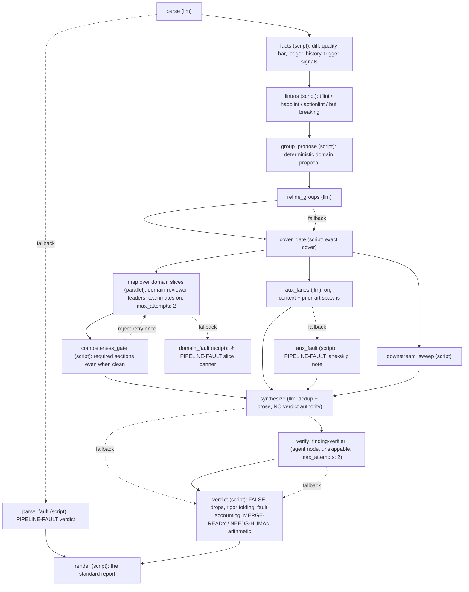

# Code Reviewer

> [!IMPORTANT]
> **v3: now a GRAPH agent.** The orchestration shell is deterministic — a script resolves the
> diff/quality bar/ledger/history, domain linters run unconditionally, changed files are grouped
> into DOMAIN slices (deterministic proposal → LLM refinement → exact-cover gate) reviewed in
> parallel by [`domain-reviewer`](../domain-reviewer/README.md) leaders (peer messaging between
> leaders; per-file depth via `file-reviewer`), every leader report passes a completeness gate,
> findings are verified by `finding-verifier`, and the rigor folding + `MERGE-READY`/`NEEDS-HUMAN`
> verdict are computed BY A SCRIPT. Judgment stays in the agents; discipline lives in the graph.
> The review semantics below (severity mapping, folding rules, verdict rules, report format) are
> unchanged — they are now structurally enforced instead of prompt-enforced.



**Failure fails closed.** Every LLM/agent node retries once (`max_attempts: 2` — the
domain-reviewer lanes and the verifier included), then routes to a `fallback:` instead of killing
the graph, and every fallback that loses review coverage leaves a `PIPELINE-FAULT` marker: a dead
`parse` emits a complete fault verdict and jumps straight to render; a dead domain lane becomes a
`> ⚠️ PIPELINE-FAULT` banner where its slice report would be; a dead `refine_groups` falls
through to the cover gate, which keeps the deterministic proposal; a dead synthesis or verifier
falls through to the verdict script. The verdict script counts every fault and forces
`NEEDS-HUMAN` — a degraded run never reads `MERGE-READY`. The aux context lanes are the one
exception: they are enrichment, so their fault (`aux_fault`) is surfaced as a lane-skip note but
never blocks. Fault detection is prefix-anchored (a report that merely *quotes* a marker doesn't
trip it), and the report is always emitted: the verdict script's own crash guard emits a
`PIPELINE-FAULT` NEEDS-HUMAN, and render bypasses its "No changes to review." stub for fault
verdicts — a fault renders as a full report, never silence.

A CodeRabbit-style code review orchestrator that coordinates per-file reviews and synthesizes findings into a unified 
report.

This agent acts as the manager for the review process, delegating actual file analysis to **[File Reviewer](../file-reviewer/README.md)** 
agents while handling coordination and final reporting.

## Features

- 🤖 **Orchestration**: Spawns parallel reviewers for each changed file.
- 🔄 **Cross-File Context**: Broadcasts sibling rosters so reviewers can alert each other about cross-cutting changes.
- 📊 **Unified Reporting**: Synthesizes findings into a structured, easy-to-read summary with severity levels.
- ⚡ **Parallel Execution**: Runs reviews concurrently for maximum speed.
- 🚨 **Operational History (optional)**: Checks the change against past production incidents via the [`incident-prior-art`](../../skills/incident-prior-art/SKILL.md) skill.
- 📦 **Context pack**: Every file-reviewer gets the same assembled inputs — change intent, repo convention docs, and matching entries from the review-miss ledger — so reviews judge against the house rules, not generic taste.
- 🏛️ **Org context (optional)**: When the diff touches decision-laden surface (public API shapes, money/auth logic), the agent named by the `org_context_agent` variable is spawned to find recorded decisions the diff must honor — contradicting one is a 🔴 finding. Disabled by default (`org_context_agent: ''`).
- 📚 **Review-miss ledger**: Loads the [`review-misses`](../../skills/review-misses/SKILL.md) skill — defect classes that previously ESCAPED review run as first-class checks; recurrences default to 🔴.
- ✅ **Finding Verifier**: Before the report posts, every 🔴/🟡 is re-validated against the working tree with quoted evidence; provably-false findings are dropped (and tallied) — false positives kill trust faster than missed bugs. Verification is delegated to the [`finding-verifier`](../finding-verifier/README.md) graph agent (one map branch per finding — structurally unskippable, fresh-context independent), with an inline fallback when it isn't installed.
- 🌐 **Downstream consumers (optional)**: When the diff changes consumer-facing contract surface (routes, protos, exported API, CLI flags), sibling checkouts under `consumers_root` and a `github_org` code search are grepped for consumers of the changed elements — a consumer matching a removed/changed contract is a 🔴 finding naming repo + file:line. Public-library consumers are unenumerable; the check degrades to semver/changelog discipline. Both probes disabled by default (`consumers_root: ''`, `github_org: ''`).
- 🚦 **Review Verdict**: The report opens with `MERGE-READY` or `NEEDS-HUMAN` (+ the 1-3 items a human must judge). Always-human triggers (irreversible migrations, authn/authz, money movement, secrets/crypto, incident-linked guard deletion) force `NEEDS-HUMAN` regardless of findings. Routing signal only — merging stays a human act.

## Operational History Lane

Code review answers "is this code good?" — this lane answers "did we already get burned by this?"
When the diff touches operationally-relevant surface (error handling, retries, timeouts, alerting,
config controlling any of these), the orchestrator:

1. **Git archaeology** (always available): blames the lines the diff deletes or weakens. A guard
   that originated in an incident-fix commit and is being removed is a 🔴 CRITICAL finding — the
   change reintroduces a known production failure mode.
2. **Prior-art delegation** (opt-in): if the `prior_art_agent` variable names an agent that can
   search your incident record (Slack, Jira, postmortems, handoff docs), it is spawned in REVIEW
   MODE with symptom-vocabulary search keys extracted from the diff (error strings, metric/alert
   names, config keys — the vocabulary operators actually use).

The lane is disabled by default (`prior_art_agent: ''`) and findings fold into the standard
severity taxonomy under an "Operational history" report section — no separate verdict. Wire it up
in a bundle or your local config:

```yaml
variables:
  - name: prior_art_agent
    default: 'oncall-historian'  # any spawnable agent that can search your incident record
```

## Pro-Tip: Use an IDE MCP Server for Improved Performance
Many modern IDEs now include MCP servers that let LLMs perform operations within the IDE itself and use IDE tools. Using
an IDE's MCP server dramatically improves the performance of coding agents. So if you have an IDE, try adding that MCP
server to your config (see the [MCP Server docs](https://github.com/Dark-Alex-17/coyote/wiki/MCP-Servers) to see how to configure
them), and modify the agent definition to look like this:

```yaml
# ...

mcp_servers:
  - jetbrains # The name of your configured IDE MCP server

global_tools:
  - fs_read.sh
  - fs_grep.sh
  - fs_glob.sh
#  - execute_command.sh

# ...
```

