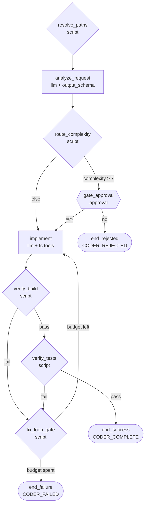

# Coder

A graph-based implementation agent. Plans, implements, and runs build +
tests in a bounded fix-loop until verified. Designed to be delegated to by
the **[Sisyphus](../sisyphus/README.md)** agent.

Coder is a [graph agent](https://github.com/Dark-Alex-17/coyote/wiki/Graph-Agents): its workflow is
defined declaratively in `graph.yaml`, with verification and the
implement-fix loop enforced as graph edges rather than prose.

## Workflow



End nodes emit one of three sentinel outcomes for the caller:

- `CODER_COMPLETE` — build and tests passed.
- `CODER_REJECTED` — user rejected the plan at the approval gate.
- `CODER_FAILED` — fix-loop exhausted; build/tests still failing.

## Tuning

The agent's `project_dir` is exposed via the standard `variables:` block,
so it accepts the runtime override flag:

```sh
# Invoke from inside the project (project_dir defaults to ".")
cd /path/to/your/project
coyote -a coder "Add a foo() function..."

# Or invoke from anywhere with an explicit override
coyote -a coder --agent-variable project_dir /path/to/your/project "Add..."
```

`graph.yaml` `initial_state` exposes:

- `max_fix_attempts` (default `3`) — fix-loop budget before `end_failure`.

Environment overrides honored by the script nodes:

- `BUILD_CMD` — skip project-type detection for the build/check command.
- `TEST_CMD` — skip detection for tests.
- `CODER_AUTOAPPROVE=1` — bypass the approval gate (for non-interactive runs
  where complexity might trip the gate).

## Pro-Tip: IDE MCP Server

Modern IDEs (JetBrains, VS Code, Cursor, Zed, etc.) expose MCP servers
that let LLMs use IDE tools directly. To wire one in, edit `graph.yaml`:

```yaml
mcp_servers:
  - your-ide-mcp-server

global_tools:
  # Keep read-only fs tools for files outside the IDE project
  - fs_read.sh
  - fs_grep.sh
  - fs_glob.sh
#  - fs_write.sh
#  - fs_patch.sh
  - execute_command.sh
```

Then add the MCP server's write/patch tools to the `implement` node's
`tools:` whitelist.
