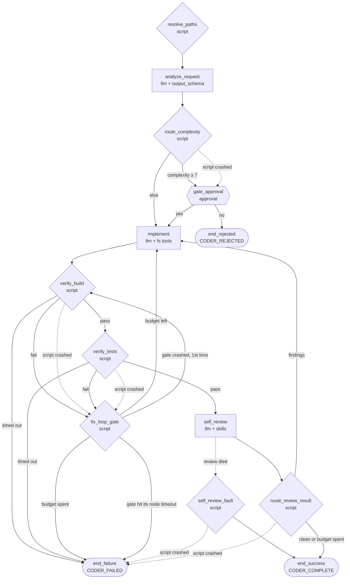

# Coder

A graph-based implementation agent. Plans, implements, and runs build +
tests in a bounded fix-loop until verified. Designed to be delegated to by
the **[Sisyphus](../sisyphus/README.md)** agent.

Coder is a [graph agent](https://github.com/Dark-Alex-17/coyote/wiki/Graph-Agents): its workflow is
defined declaratively in `graph.yaml`, with verification and the
implement-fix loop enforced as graph edges rather than prose.

## Workflow


```mermaid
flowchart TD
    resolve_paths{"resolve_paths<br/>script"} --> analyze_request
    analyze_request["analyze_request<br/>llm + output_schema"] --> route_complexity
    route_complexity{"route_complexity<br/>script"}
    route_complexity -->|"complexity ≥ 7"| gate_approval
    route_complexity -->|else| implement
    route_complexity -. "script crashed" .-> gate_approval
    gate_approval{{"gate_approval<br/>approval"}}
    gate_approval -->|yes| implement
    gate_approval -->|no| end_rejected
    implement["implement<br/>llm + fs tools"] --> verify_build
    verify_build{"verify_build<br/>script"}
    verify_build -->|pass| verify_tests
    verify_build -->|fail| fix_loop_gate
    verify_build -->|"timed out"| end_failure
    verify_build -. "script crashed" .-> fix_loop_gate
    verify_tests{"verify_tests<br/>script"}
    verify_tests -->|pass| self_review
    verify_tests -->|fail| fix_loop_gate
    verify_tests -->|"timed out"| end_failure
    verify_tests -. "script crashed" .-> fix_loop_gate
    fix_loop_gate{"fix_loop_gate<br/>script"}
    fix_loop_gate -->|"budget left"| implement
    fix_loop_gate -->|"budget spent"| end_failure
    fix_loop_gate -->|"gate crashed, 1st time"| verify_build
    fix_loop_gate -->|"gate hit its node timeout"| end_failure
    self_review["self_review<br/>llm + skills"] --> route_review_result
    self_review -. "review died" .-> self_review_fault
    self_review_fault{"self_review_fault<br/>script"} --> end_success
    self_review_fault -. "script crashed" .-> end_failure
    route_review_result{"route_review_result<br/>script"}
    route_review_result -->|"clean or budget spent"| end_success
    route_review_result -->|findings| implement
    route_review_result -. "script crashed" .-> end_failure

    end_success(["end_success<br/>CODER_COMPLETE"])
    end_rejected(["end_rejected<br/>CODER_REJECTED"])
    end_failure(["end_failure<br/>CODER_FAILED"])
```

End nodes emit one of three sentinel outcomes for the caller:

- `CODER_COMPLETE` — build and tests passed.
  Its `Design:` line carries the self-review's `design_notes`: every pattern
  the diff introduced that the repo did not already use (pattern, files, call
  sites touched, one per line, reconciled against the implementer's own
  `Design:` heading), empty when the change only followed precedent or when
  the self-review did not run. It may also carry a `Design: ASK -- <question>`
  line: a restructure beyond the task's scope the implementer could not get
  answered, for the orchestrator to put to the user. An ASK the implementer
  recorded survives even when the self-review did not run: `self_review_fault`
  copies the `ASK --` lines from the implement passes into `design_notes`. A
  disclosure for the orchestrator's report, not a verdict.
- `CODER_REJECTED` — user rejected the plan at the approval gate.
- `CODER_FAILED` — fix-loop exhausted; build/tests still failing — or the
  verification gate crashed twice (see `Verification gate error:`), or
  `route_review_result` / `self_review_fault` crashed (see
  `Last script error:`). A routing script that died has decided nothing, so
  the run does not end as `CODER_COMPLETE` on its behalf. The one gate that
  falls toward a human instead is `route_complexity`: a crash there asks for
  plan approval rather than skipping it.
  A verify gate that ran out of time is not a red run: its
  `Verification gate error:` starts with `verify_build TIMED OUT` /
  `verify_tests TIMED OUT` (killed at `build_timeout` / `test_timeout`) or
  with `TIMED OUT` (killed by the engine at the node timeout), and the run
  ends at once instead of spending fix attempts on code nothing showed broken.

## Tuning

The agent's `project_dir` is exposed via the standard `variables:` block,
so it accepts the runtime override flag:

```sh
# Invoke from inside the project (project_dir defaults to ".")
cd /path/to/your/project
coyote -a coder "Add a foo() function..."

# Or invoke from anywhere with an explicit override
coyote -a coder --agent-variable project_dir /path/to/your/project "Add..."
```

A spawned coder whose caller left `project_dir` unset inherits the engine's
working directory, which may be a different checkout from the one it edits.
In that case the verify gates run at the root of the git work tree holding
every absolute file in the plan, provided that tree does not contain the
working directory; each gate's transcript names the directory on its
`Ran in:` line. Passing `project_dir` explicitly is still the reliable form.

`graph.yaml` `initial_state` exposes:

- `max_fix_attempts` (default `5`) — fix-loop budget before `end_failure`.

`graph.yaml` `variables` also exposes:

- `test_command` (default empty): the command `verify_tests` runs instead
  of the detected one, e.g. a targeted `cargo test --test my_suite` when the
  full suite does not fit the deadline. It takes precedence over `TEST_CMD`.
- `build_timeout` (default `900`) and `test_timeout` (default `1800`): whole
  seconds each gate may run before it kills the command's whole process
  group and ends the run with a `TIMED OUT` gate error rather than a red
  verdict. `0` disables the deadline. Keep them below the nodes' own
  timeouts (1800 s build, 3600 s tests); a gate the engine kills there is
  also reported as `TIMED OUT`, but its children are not reaped.
- `build_lock` (default empty): command prefix applied to every gate (build
  and tests), e.g. `flock /tmp/coyote-cargo.lock` so parallel agents sharing
  one target directory serialise their gate runs (the coder's own ad-hoc
  cargo calls are not covered). The whole gate command runs under the prefix
  as one unit. Waiting on the lock counts toward the gate's deadline
  (`build_timeout` / `test_timeout`), so prefer `flock -w <secs>` or raise
  those deadlines when runs are long. A gate killed while still waiting can
  leave the lock request queued; `-w` below the deadline makes
  it give up instead of running later unobserved. The prefix is a shell
  fragment and is re-parsed: quote paths containing spaces
  (`flock '/tmp/my lock'`); `$VAR` inside it expands when the gate runs.
  `flock` is util-linux (not shipped on macOS);
  any wrapper that serialises its argument command works.

  ```bash
  coyote -a coder --agent-variable build_lock 'flock -w 240 /tmp/coyote-cargo.lock' "Add..."
  ```

Environment overrides honored by the script nodes:

- `BUILD_CMD` — skip project-type detection for the build/check command.
  Under a `build_lock` prefix the inner shell sees only exported variables;
  a gate command must not depend on the gate script's own locals.
- `TEST_CMD`: skip detection for tests (the `test_command` variable wins).
- `COYOTE_GATE_OUTPUT_MAX_BYTES` — cap on each gate transcript kept in state
  (default 64 KiB; keeps the head ¼ and tail ¾, trimming the middle).
- `CODER_AUTOAPPROVE=1` — bypass the approval gate (for non-interactive runs
  where complexity might trip the gate). Does not cover a crash of
  `route_complexity`, which asks for approval regardless.

## Pro-Tip: IDE MCP Server

Modern IDEs (JetBrains, VS Code, Cursor, Zed, etc.) expose MCP servers
that let LLMs use IDE tools directly. To wire one in, edit `graph.yaml`:

```yaml
mcp_servers:
  - your-ide-mcp-server

global_tools:
  # Keep read-only fs tools for files outside the IDE project
  - fs_read.sh
  - fs_grep.sh
  - fs_glob.sh
#  - fs_write.sh
#  - fs_patch.sh
  - execute_command.sh
```

Then add the MCP server's write/patch tools to the `implement` node's
`tools:` whitelist.
