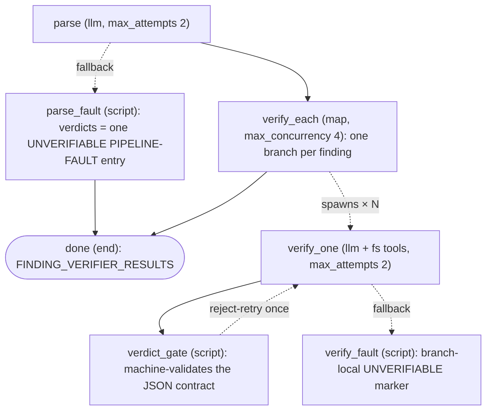

# finding-verifier

A **graph** agent that independently verifies code-review findings against the working
tree. It exists because false positives kill hands-off trust faster than missed bugs do —
and because an orchestrator verifying its own workers' findings inline can skip, fudge,
or confirmation-bias the check. A graph can't: the structure IS the discipline.

## How it works

1. **parse** — extracts every 🔴/🟡 finding from the spawn prompt into a structured list
   (id, severity verbatim, path, lines, self-contained claim). Extraction only — no judging.
   Gets two attempts (`max_attempts: 2`); if both fail, its `fallback` routes to
   `parse_fault`, which rewrites `verdicts` to a single UNVERIFIABLE entry naming the fault
   and jumps straight to `done`.
2. **verify_each** — a `map` node fans out one `verify_one` branch per finding. Skipping a
   finding is structurally impossible; results collect in input order.
3. **verify_one** — reads the cited code (greps for moved code before concluding anything)
   and answers ONE narrow question: does the cited code exist, and does it behave as the
   claim says? Verdicts:
   - `VERIFIED` — with the decisive line(s) quoted verbatim (`path:line`).
   - `FALSE` — the code doesn't exist anywhere or provably doesn't do what the claim says.
     Requires PROOF, not disagreement — doubt never lands here.
   - `UNVERIFIABLE` — couldn't establish either way (runtime behavior, external systems).

   Each branch is a chain: `verify_one → verdict_gate`. The gate machine-validates the JSON
   contract (verdict enum; evidence required for VERIFIED/FALSE; note for UNVERIFIABLE),
   stamps the authoritative id FROM the finding item (the model's echo is never trusted),
   rejects back to `verify_one` exactly once with the reason, and on a second failure records
   UNVERIFIABLE — a malformed branch never sinks the map. If `verify_one` itself dies (both
   `max_attempts: 2` attempts fail), its `fallback` routes to `verify_fault`, which
   normalizes the engine's failure text into a branch-local UNVERIFIABLE verdict the map
   still collects.
4. **done** — a deterministic `end` node emits the raw verdict list plus the caller
   contract (VERIFIED = keep + paste evidence; FALSE = drop + tally; UNVERIFIABLE = keep,
   marked). No final LLM step that could editorialize.

The dashed edges are fault paths. All three fault emitters (`parse_fault`, `verify_fault`,
and `verdict_gate`'s own crash guard) surface as `PIPELINE-FAULT:` text in a verdict's
`note`, and a fault can only ever produce UNVERIFIABLE — degraded output is never a
passing verdict. Every path ends at `done`, so the `FINDING_VERIFIER_RESULTS`
sentinel is always emitted and the caller's verify lane degrades instead of dying.

## What it is NOT

- **Not a second opinion.** It never re-judges severity, style, or whether a finding
  "matters" — that authority stays with the reviewers and the orchestrator's rigor rules.
- **Not a reviewer.** It reads only what findings cite (plus greps to locate moved code).

## Caller

Spawned by [`code-reviewer`](../code-reviewer/README.md) during its Finding Verifier
pass, ONCE per review, with the full 🔴/🟡 list and `project_dir`. If this agent isn't
installed, code-reviewer runs the same contract inline as a fallback.

## Files

- `graph.yaml` — the agent (no tools.sh; the graph grants `fs_read`/`fs_cat`/`fs_grep`
  per node).
- `scripts/verdict_gate.py` — the deterministic contract gate.
- `scripts/parse_fault.py`, `scripts/verify_fault.py` — the fault markers behind the
  dashed fallback edges.
