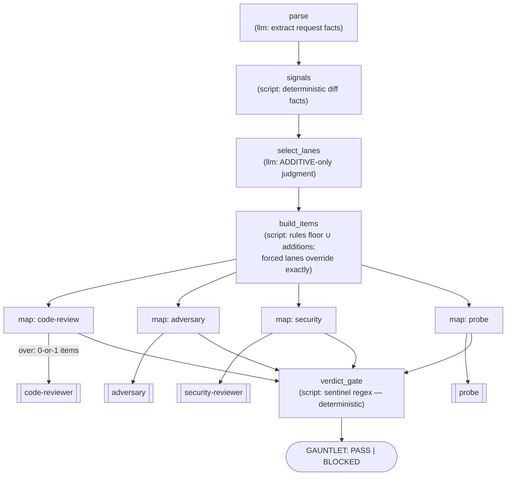

# Review Gauntlet

A graph-based post-implementation review gate — **"the done gate"**. An
orchestrator that must not claim *done* without green reviews spawns this agent
once instead of judging trigger rules and parsing verdict sentinels itself. The
graph structure makes skipping a lane or misreading a verdict impossible:
trigger signals are computed by a script, lanes run as isolated parallel
sub-agents, and the final verdict is a deterministic regex gate — an LLM never
gets the chance to rationalize past it.



## Why a graph

The four independent review lanes existed before this agent — as **prompt
discipline** inside the calling orchestrator: "spawn code-reviewer when the
change is broad", "🔴 always blocks", "INCONCLUSIVE is never PASS". Prompt
discipline degrades under context pressure: a lane gets skipped, a verdict
line gets paraphrased, a missing report reads as "nothing to report". Here
those rules are *structure*:

- **Lane selection floor is deterministic** (`build_items.py`): code-review
  always runs; adversary runs when a spec/plan is present; security runs on
  attack-surface signals (auth/deps/exec paths or diff content) or hardened
  posture; probe runs when consumer-facing surface changed *and* a local-run
  recipe exists. The `select_lanes` LLM can only **widen** the set — a false
  flag never removes a rule-selected lane. `forced_lanes` from the caller
  override everything exactly.
- **Conditional lanes without dynamic routing**: each lane is a `map` node
  over a 0-or-1-item list — an empty list means the map runs zero branches
  (map-over-nothing), which *is* the skip mechanism. All four maps join at
  the verdict gate on equal-length paths.
- **The verdict is a regex, not an opinion** (`verdict_gate.py`): a missing
  sentinel is a lane FAILURE, never a pass; any 🔴 in the code-review report
  blocks regardless of its verdict line; `NEEDS-HUMAN` without 🔴 passes but
  is surfaced under *Human attention required*; probe `INCONCLUSIVE` blocks
  with an environment note — it is never treated as PASS or FAIL.
- **Verdict independence is structural**: lanes run as isolated sub-agents
  with no `teammates:` flag — no cross-lane messaging, by construction.

## Sentinels parsed

| Lane | Sentinel | Blocks on |
|------|----------|-----------|
| code-reviewer | `**Verdict: MERGE-READY \| NEEDS-HUMAN**` | any 🔴 finding; missing sentinel |
| adversary | `ADVERSARIAL_REVIEW: CONFORMS \| DIVERGES` | DIVERGES; missing sentinel |
| security-reviewer | `SECURITY_REVIEW: PASS \| FAIL` | FAIL; missing sentinel |
| probe | `USAGE_PROBE: PASS \| FAIL \| INCONCLUSIVE` | FAIL; INCONCLUSIVE (environment note); missing sentinel |

## Spawning it

```
agent__spawn --agent review-gauntlet --prompt "Post-implementation review gate.

Project: /abs/path/to/repo
Diff: main...HEAD          (a git range, a ref, or 'worktree' for uncommitted changes)
Rigor: production          Security posture: standard

Plan / acceptance criteria:
<paste the criteria the implementation must satisfy — enables the adversary lane>

Local-run recipe / usage suites:
<how to boot the service locally + where existing suites live — enables the probe lane>

Forced lanes: (optional — e.g. 'adversary, probe' to run exactly those)"
```

The reply ends with `GAUNTLET: PASS` or `GAUNTLET: BLOCKED`, a lane status
table, the lane-selection reasons, blockers, attention items, and each lane's
full report in a collapsible section. On BLOCKED: fix the findings per your
own findings-handling rules, then spawn a **fresh** gauntlet run. On PASS with
*Human attention required*: complete the work but carry those items into your
final report verbatim.

## Notes

- The caller decides *whether* review is warranted at all (the gauntlet is for
  non-trivial work — that's why code-review is unconditionally on); the
  gauntlet decides *which* of the other lanes apply and what the verdicts mean.
- Lane sub-agents get generous finite timeouts (2h each; 3h whole-gauntlet).
  A lane that dies or times out produces no sentinel — which is a BLOCKED,
  never a silent pass.
- Signals failures degrade gracefully: if git can't compute the diff, lane
  selection falls back to caller context + forced lanes, and the report notes
  it. The auth-path regex deliberately over-fires (`auth(?!or)` matches
  auth/authn/authz/oauth but not "author") — the safe direction, since signals
  only ever ADD the security lane.
- Requires the `code-reviewer`, `adversary`, `security-reviewer`, and `probe`
  agents to be installed (they ship with Coyote).
