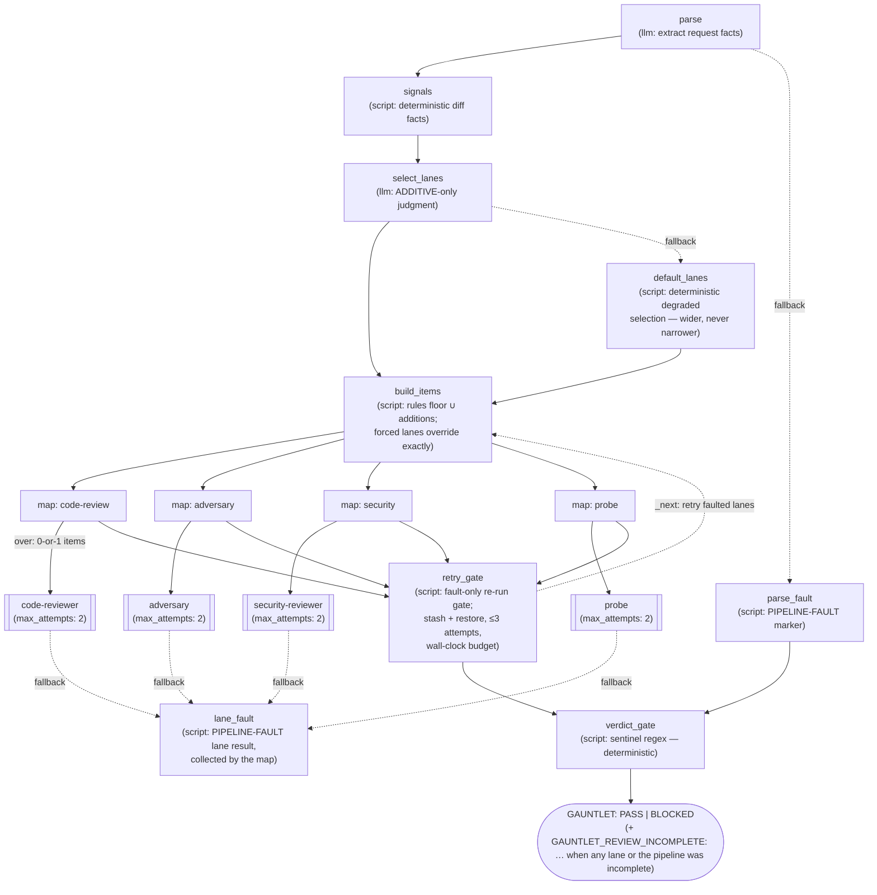

# Review Gauntlet

A graph-based post-implementation review gate — **"the done gate"**. An
orchestrator that must not claim *done* without green reviews spawns this agent
once instead of judging trigger rules and parsing verdict sentinels itself. The
graph structure makes skipping a lane or misreading a verdict impossible:
trigger signals are computed by a script, lanes run as isolated parallel
sub-agents, and the final verdict is a deterministic regex gate — an LLM never
gets the chance to rationalize past it.



## Why a graph

The four independent review lanes existed before this agent — as **prompt
discipline** inside the calling orchestrator: "spawn code-reviewer when the
change is broad", "🔴 always blocks", "INCONCLUSIVE is never PASS". Prompt
discipline degrades under context pressure: a lane gets skipped, a verdict
line gets paraphrased, a missing report reads as "nothing to report". Here
those rules are *structure*:

- **Lane selection floor is deterministic** (`build_items.py`): code-review
  always runs; adversary runs when a spec/plan is present; security runs on
  attack-surface signals (auth/deps/exec paths or diff content) or hardened
  posture; probe runs when consumer-facing surface changed *and* a local-run
  recipe exists. The `select_lanes` LLM can only **widen** the set — a false
  flag never removes a rule-selected lane. `forced_lanes` from the caller
  override everything exactly.
- **Conditional lanes without dynamic routing**: each lane is a `map` node
  over a 0-or-1-item list — an empty list means the map runs zero branches
  (map-over-nothing), which *is* the skip mechanism. All four maps join at
  the retry gate on equal-length paths; it falls through to the verdict
  gate, or routes back to `build_items` for faulted lanes only.
- **The verdict is a regex, not an opinion** (`verdict_gate.py`): a missing
  sentinel is a lane FAILURE, never a pass; the critical count from the
  code-review report's summary line (raw 🔴 count if absent) blocks
  regardless of its verdict line; a code-review lane whose own verdict line
  records a pipeline fault blocks (a degraded review is never a pass);
  `NEEDS-HUMAN` without 🔴 passes but
  is surfaced under *Human attention required*; probe `INCONCLUSIVE` blocks
  with an environment note — it is never treated as PASS or FAIL.
- **Verdict independence is structural**: lanes run as isolated sub-agents
  with no `teammates:` flag — no cross-lane messaging, by construction.
- **Failure fails closed, structurally** (`fallback:` routes + `PIPELINE-FAULT`
  markers): every LLM node and lane retries once (`max_attempts: 2`), then a
  fallback fires instead of killing the graph — and every fallback degrades
  toward BLOCKED, never toward a pass. A dead lane becomes a `PIPELINE-FAULT:`
  lane result (`lane_fault.py`) that the gate reports as BLOCKED *naming the
  lane* — distinct from SKIPPED (not selected). A dead `parse` records a fault
  and jumps straight to the gate (`parse_fault.py`). A dead `select_lanes`
  degrades to a deterministic selection (`default_lanes.py`): code-review +
  adversary, plus probe on consumer surface *with a local-run recipe*, plus
  security on auth/deps/exec
  signals or hardened posture, unioned with caller-forced lanes — wider, never
  narrower. A crashed `build_items` records a fault so an all-SKIPPED gate
  still blocks. Fault detection is prefix-anchored — a real review that merely
  *quotes* "PIPELINE-FAULT:" flows to the normal sentinel rules. And the
  `GAUNTLET:` sentinel is always emitted: even a crashed gate prints
  `GAUNTLET: BLOCKED`, never silence.

## Fault-only re-runs

`retry_gate.py` sits between the lane maps and the verdict gate and re-runs
only lanes that **faulted** — a missing report (stood in for by a synthetic
`PIPELINE-FAULT: <lane> lane produced no report` marker so it never renders as
SKIPPED), a non-string report, the `lane_fault` marker, a sentinel-less
report, or a nested graph's own degraded-run wording. A real verdict
(DIVERGES, FAIL, INCONCLUSIVE, NEEDS-HUMAN, …) is never re-run: the review's
judgment stands. Each lane gets up to 3 attempts, all inside a wall-clock
budget (`MAX_RETRY_ELAPSED_SECS`) sized to fit the graph timeout.

- **Stash + restore**: every lane report that ran this pass is stashed in
  `kept_results`; a re-run pass overwrites the untouched lanes' collected
  results with `[]`, so their stashed reports are restored before the gate.
  The verdict gate always sees each lane's *last* report.
- **Retry never narrows selection**: lane selection is not re-run. A re-run
  pass rebuilds items only for the retried lanes, and the stashed results
  stand in for the rest.
- **Exhaustion is recorded, not hidden**: a lane still faulted after its
  attempts or the budget lands in `review_incomplete`, and its fault flows to
  the verdict gate as-is.
- **Crash guards append**: the `build_items.py` and `retry_gate.py` crash
  guards append to an existing `signals_error` rather than overwrite it, and
  `build_items.py` preserves the prior `lanes_summary`.

Whenever at least one lane (or the pipeline) could not complete, the first
line reads `GAUNTLET: BLOCKED` followed immediately by
`GAUNTLET_REVIEW_INCOMPLETE: <lane>[, <lane>]`. The names are the exhausted
lanes from `review_incomplete`, plus the `pipeline` pseudo-lane whenever a
pipeline-level `PIPELINE-FAULT:` fired — parse death, or a crash in the
builder, the retry gate, the default-lanes fallback, or the verdict gate
itself (the default-lanes fallback's crash still runs the widened lanes, so
`pipeline` appears alongside real lane rows). The report gains a
`## Review incomplete` section naming each exhausted lane with its
attempt count; `PIPELINE-FAULT` lane rows carry ` ×N` when the lane was
re-run (N > 1). The *named* entries are faults to re-run, never code
findings; the line can accompany real findings from the other lanes, which
still appear under `## Blockers` and must be fixed as usual.

## Sentinels parsed

| Lane | Sentinel | Blocks on |
|------|----------|-----------|
| code-reviewer | `**Verdict: MERGE-READY \| NEEDS-HUMAN**` | critical count from the report's summary line (raw 🔴 count if absent); missing sentinel; own verdict line records a pipeline fault |
| adversary | `ADVERSARIAL_REVIEW: CONFORMS \| DIVERGES` | DIVERGES; missing sentinel |
| security-reviewer | `SECURITY_REVIEW: PASS \| FAIL` | FAIL; missing sentinel |
| probe | `USAGE_PROBE: PASS \| FAIL \| INCONCLUSIVE` | FAIL; INCONCLUSIVE (environment note); missing sentinel |

## Spawning it

```
agent__spawn --agent review-gauntlet --prompt "Post-implementation review gate.

Project: /abs/path/to/repo
Diff: main...HEAD          (a git range, a ref, or 'worktree' for uncommitted changes)
Rigor: production          Security posture: standard

Plan / acceptance criteria:
<paste the criteria the implementation must satisfy — enables the adversary lane>

Local-run recipe / usage suites:
<how to boot the service locally + where existing suites live — enables the probe lane>

Forced lanes: (optional — e.g. 'adversary, probe' to run exactly those)" \
  --variables {"verification_commands": "[\"cargo test --all\", \"cargo clippy -- -D warnings\"]"}
```

Verification commands are NOT part of the prompt. They are the declared
`verification_commands` graph variable (default `'[]'`; a JSON array of shell
commands as a string, since agent variables arrive as strings), also settable
from the CLI:

```sh
coyote -a review-gauntlet --agent-variable project_dir /abs/path/to/repo \
  --agent-variable verification_commands '["cargo test --all"]' "<prompt>"
```

The reply opens with `GAUNTLET: PASS` or `GAUNTLET: BLOCKED` (plus the
`GAUNTLET_REVIEW_INCOMPLETE:` line when applicable), followed by a lane status
table, the lane-selection reasons, blockers, attention items, and each lane's
full report in a collapsible section. On BLOCKED with a
`GAUNTLET_REVIEW_INCOMPLETE:` line: the named lanes never completed — fix any
non-fault blockers listed under `## Blockers`, then spawn a **fresh** gauntlet
run (a fault is never a code finding). On BLOCKED without it: fix the findings
per your own findings-handling rules, then spawn a **fresh** gauntlet run. On
PASS with *Human attention required*: complete the work but carry those items
into your final report verbatim.

## Notes

- The caller decides *whether* review is warranted at all (the gauntlet is for
  non-trivial work — that's why code-review is unconditionally on); the
  gauntlet decides *which* of the other lanes apply and what the verdicts mean.
- Lane sub-agents get generous finite per-attempt timeouts (see the
  `timeout:` on each `run_*` node) and one retry (`max_attempts: 2`) inside
  the lane, then up to 3 attempts of the whole lane from `retry_gate.py` while
  the wall-clock budget (`MAX_RETRY_ELAPSED_SECS`) allows; `settings.timeout`
  is derived from that envelope in graph.yaml's comment. A lane that still
  dies or times out falls back to the `lane_fault` marker — BLOCKED naming the
  lane and `GAUNTLET_REVIEW_INCOMPLETE`, never a silent pass.
- The `verification_commands` variable is forwarded to the adversary lane as a
  structured `inputs:` passthrough on `run_adversary` (a lone `{{…}}` template
  lands the raw value in the child's state) — never through the lane prompt
  and never extracted by `parse`. The adversary's `run_checks` stage executes
  those commands with a shell, which makes the declaration a trust boundary:
  the prompt also carries plan text pasted from the repo under review, so
  commands must never be inferred from it, and the engine merges only the keys
  `parse`'s `output_schema.properties` declares, so an extra
  `verification_commands` key emitted by the LLM is dropped before it reaches
  state.
  Undeclared stays undeclared
  (`'[]'` ⇒ "none declared"); a declaration that is not a JSON array of
  strings executes nothing and records a `PIPELINE-FAULT`, which the
  adversary lane reports as DIVERGES and the gate as BLOCKED.
- Signals failures degrade gracefully: if git can't compute the diff, lane
  selection falls back to caller context + forced lanes, and the report notes
  it. The auth-path regex deliberately over-fires (`auth(?!or)` matches
  auth/authn/authz/oauth but not "author") — the safe direction, since signals
  only ever ADD the security lane.
- Requires the `code-reviewer`, `adversary`, `security-reviewer`, and `probe`
  agents to be installed (they ship with Coyote).
