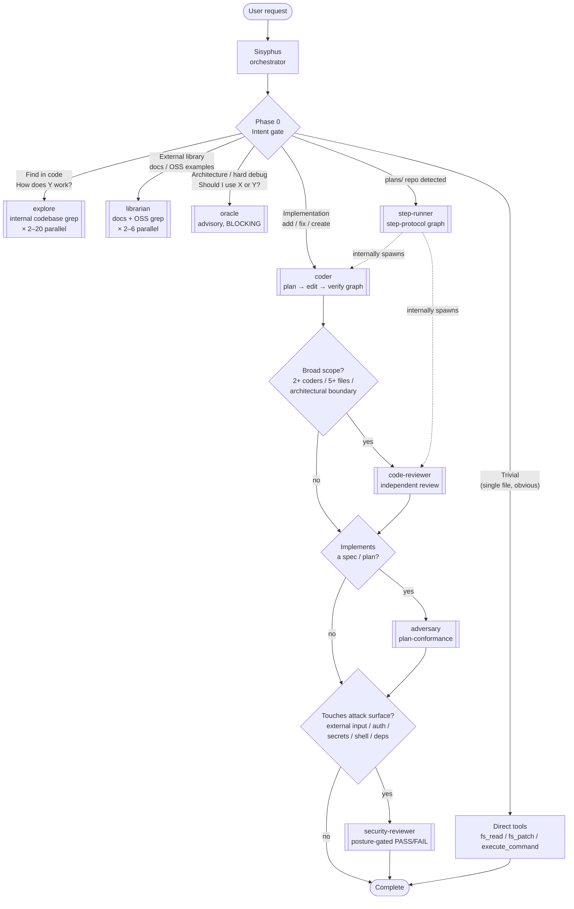

# Sisyphus

The main coordinator agent for the Coyote coding ecosystem, providing a powerful CLI interface for code generation and
project management similar to OpenCode, ClaudeCode, Codex, or Gemini CLI.

_Inspired by the Sisyphus and Oracle agents of OpenCode._

Sisyphus acts as the primary entry point. Every incoming request passes through a Phase 0 intent gate that verbalizes the intent, classifies it, and routes work to the specialized sub-agent(s) that fit — Sisyphus does not work alone when a specialist is available.

## Architecture



Spawnable sub-agents (from `config.yaml`):

- **[explore](../explore/README.md)** — internal codebase grep. Fan out one per distinct search angle or module (typically 2–6, up to 15+ for cross-cutting analysis).
- **[librarian](../librarian/README.md)** — external grep for official docs and production OSS examples. Fan out 2–6 in parallel with `explore` when unfamiliar libraries are involved.
- **[oracle](../oracle/README.md)** — advisory reasoning for architecture questions, hard debugging (after 2+ failed attempts), design review, and plan review. Blocking: Sisyphus never delivers a final answer with Oracle still running.
- **[coder](../coder/README.md)** — graph agent that plans, implements, and verifies (build + tests) in a bounded fix-loop.
- **[code-reviewer](../code-reviewer/README.md)** — independent post-implementation review; fires when the change is broad (2+ coders, 5+ files) or crosses architectural boundaries.
- **[adversary](../adversary/README.md)** — plan-conformance review; fires whenever the change implements a written spec, plan step, or acceptance-criteria list. Orthogonal to `code-reviewer` — both can run.
- **[security-reviewer](../security-reviewer/README.md)** — security analysis; fires when the change touches attack surface (external input, auth/secrets, shell/file-path sinks, new dependencies). Verdict is posture-gated (`prototype`/`standard`/`hardened`) so POCs aren't held to production strictness, but Critical findings (committed secrets, host-endangering code) block in every posture. Orthogonal to both other reviewers — all three can run.
- **[step-runner](../step-runner/README.md)** — graph agent that executes one step of a phased plan repo. Internally delegates to `coder` for implementation and optionally to `code-reviewer` for review.

## Features

- 🤖 **Coordinator**: Manages multi-step workflows and delegates to specialized agents.
- 💻 **CLI Coding**: Provides a natural language interface for writing and editing code.
- 🔄 **Task Management**: Tracks progress and context across complex operations.
- 🛠️ **Tool Integration**: Seamlessly uses system tools for building, testing, and file manipulation.
- 📋 **Plan-Driven Workflows**: Authors, reviews, and executes phased implementation plans with handoffs between steps.

## Plan-Driven Workflows

For large features, Sisyphus supports a phased workflow backed by a plan repo (`plans/` with `steps/`, `handoffs/`, and
a rolling `NOTES.md`):

1. **Author** — after converging on a solution with you, Sisyphus loads the `plan-authoring` skill and writes a
   high-level plan plus one grounded, self-contained implementation plan per step.
2. **Review** — [Oracle](../oracle/README.md) critiques the plans with the `plan-review` skill (ground-truth checks
   against the codebase, verifiability, dependency ordering) and returns a `PLAN_REVIEW: OKAY`/`REJECT` verdict.
   Rejected plans are fixed before any code is written.
3. **Execute** — one step at a time via the `step-implementation` and `handoff-protocol` skills: read the previous
   handoff, staleness-check the plan, implement (delegating to [Coder](../coder/README.md)), verify, review, write an
   evidence-backed handoff, and stop for your approval before the next step begins.

## Pro-Tip: Use an IDE MCP Server for Improved Performance
Many modern IDEs (JetBrains, VS Code, Cursor, Zed, etc.) expose MCP servers that let LLMs use IDE tools directly. Using
one dramatically improves the performance of coding agents. If you have one, add it to your coyote config (see the
[MCP Server docs](https://github.com/Dark-Alex-17/loki/wiki/MCP-Servers)) and reference it in this agent's `mcp_servers:` list:

```yaml
# ...

mcp_servers:
  - your-ide-mcp-server

global_tools:
  - fs_read.sh
  - fs_grep.sh
  - fs_glob.sh
  - fs_ls.sh
  - web_search_coyote.sh
  - execute_command.sh

# ...
```
