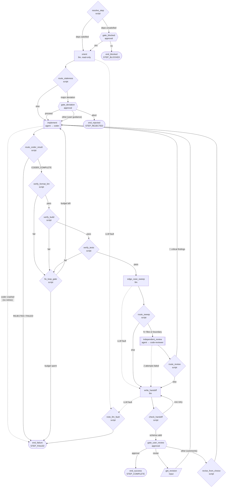

# Step-Runner

A graph-based agent that executes **one step** of a phased implementation
plan, with the step protocol from the `step-implementation` skill enforced
as graph edges rather than prose. Designed to be delegated to by
**[Sisyphus](../sisyphus/README.md)**; delegates implementation to
**[Coder](../coder/README.md)** and independent review to
**[code-reviewer](../code-reviewer/README.md)**.

It expects a plan repo authored per the `plan-authoring` skill:

```
plans/
  steps/NN-<slug>.md    # step plans with frontmatter (step/title/depends_on/status)
  handoffs/NN-<slug>.md # written by this agent, validated by a deterministic gate
  NOTES.md              # rolling durable facts
```

## Workflow



End nodes emit sentinel outcomes for the caller:

- `STEP_COMPLETE` — step implemented, verified, handoff written, user approved.
- `STEP_BLOCKED` — `depends_on` unsatisfied and the user declined to proceed.
- `STEP_REJECTED` — user aborted at the deviation gate, or the coder's plan
  was rejected at its approval gate.
- `STEP_FAILED` — the coder failed or crashed, the step-level fix budget was
  exhausted, the handoff failed validation twice, or an orient/handoff LLM
  fault was recorded (rendered as `Pipeline fault:` in the output).

## Fault handling

Node crashes degrade the run visibly instead of masquerading as success:

- `implement` has **no retries** — rerunning a coder that died mid-edit
  against an already-mutated tree is unsafe. Its failure text lands in
  `coder_result` and the run falls straight to `end_failure`.
- `independent_review` retries once (`max_attempts: 2`); if both attempts
  fail it falls back to `write_handoff`, which flags "PIPELINE-FAULT:
  independent review did not run" in the handoff rather than presenting the
  failure text as findings. `route_review` carries the same guard before its
  🔴 grep, so a reviewer fault never spends a fix-loop attempt.
- `edge_case_sweep` faults likewise fall through to `write_handoff` and are
  flagged as "PIPELINE-FAULT: edge-case sweep did not run".
- `orient` and `write_handoff` faults route through `note_llm_fault`, which
  distills the engine's failure text into a `fault_note` rendered in the
  `STEP_FAILED` output — never an empty shell.

Degraded is never passing (a skipped review or sweep is recorded as NOT RUN,
never paraphrased as covered), and the sentinel is always emitted — every
path terminates at one of the four end nodes, so the caller always gets a
parseable outcome.

## Usage

```sh
# From the project root: run the next in-progress/pending step
coyote -a step-runner "Execute the next step"

# A specific step (also parsed from the prompt: "execute step 3")
coyote -a step-runner --agent-variable step 3 "Execute step 3"

# Plan repo somewhere else
coyote -a step-runner --agent-variable plans_dir docs/plans "Execute the next step"
```

**Invoke from the project root.** The coder sub-agent resolves its own
`project_dir` from the invocation directory; overriding `project_dir` here
does not propagate to the spawned coder.

## Tuning

`graph.yaml` `initial_state` exposes:

- `max_fix_attempts` (default `2`) — step-level fix budget (the coder has
  its own internal budget of 3).
- `max_review_attempts` (default `1`) — bounded 🔴-finding fix loops after
  independent review.

Environment overrides honored by the script nodes:

- `FORMAT_CMD` / `LINT_CMD` — formatting and linting (otherwise a per-type
  heuristic formats, and linting defers to the build/check command).
- `BUILD_CMD` / `TEST_CMD` — skip project-type detection (same as coder).
- `STEP_AUTOAPPROVE=1` — bypass the deviation gate (non-interactive runs).
- `STEP_SKIP_REVIEW=1` — never spawn the independent reviewer.

The final user approval gate is never bypassed by an environment variable -
it is the point of the workflow.
