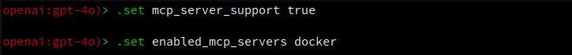

# MCP Servers
[MCP servers](https://modelcontextprotocol.io/docs/getting-started/intro) are essentially APIs designed specifically for LLMs that work like a remote repository of
tools for the model to access and extend its capabilities.

So think of it like this: Instead of having to write all your own custom tools to interact with different
services, those services can expose their functionality through an MCP server.

Loki has first-class support for MCP servers.

As mentioned in the [Loki Vault documentation](../VAULT.md), Loki can inject sensitive
configuration data into your MCP configuration file to ensure that secrets are not hard-coded.

## Quick Links
<!--toc:start-->
- [Important Note](#important-note)
- [MCP Server Configuration](#mcp-server-configuration)
  - [Secret Injection](#secret-injection)
- [Default MCP Servers](#default-mcp-servers)
- [Loki Configuration](#loki-configuration)
  - [Global Configuration](#global-configuration)
  - [Role Configuration](#role-configuration)
  - [Agent Configuration](#agent-configuration)
<!--toc:end-->

---

## Important Note
Be careful how many MCP servers you enable at one time, regardless of the context. When there is a significant
number of configured MCP servers, enabling too many MCP servers may overwhelm the context length of a model,
and quickly exceed token limits.

## MCP Server Configuration
Loki stores the MCP server configuration file, `functions/mcp.json`, in the `functions` directory. You can find
this directory using the following command:

```shell
loki --info | grep functions_dir | awk '{print $2}'
```

The syntax for the `functions/mcp.json` file is compatible with MCP server configurations for Claude Desktop.
So any time you're looking to add a new server, look at the docs for it and find the configuration example for
Claude Desktop. You should be able to use the exact same configuration in your `functions/mcp.json` file.

Every server entry **must** include a `"type"` field set to one of: `"stdio"`, `"http"`, or `"sse"`.

### Transport Types

Loki supports three MCP transport types:

| Type    | Use Case                                                                                                                                                        |
|---------|-----------------------------------------------------------------------------------------------------------------------------------------------------------------|
| `stdio` | Spawns a local subprocess and communicates over stdin/stdout                                                                                                    |
| `http`  | Connects to a remote server via [Streamable HTTP](https://modelcontextprotocol.io/docs/concepts/transports#streamable-http)                                     |
| `sse`   | Connects to a remote server via the legacy [HTTP+SSE](https://modelcontextprotocol.io/docs/concepts/transports#http-with-sse) transport (Claude Desktop format) |

### Stdio Servers

Stdio is the standard transport for locally-installed MCP servers. Loki spawns the process and communicates
over stdin/stdout:

```json
{
  "mcpServers": {
    "github": {
      "type": "stdio",
      "command": "docker",
      "args": ["run", "-i", "--rm", "ghcr.io/github/github-mcp-server"],
      "env": {
        "GITHUB_PERSONAL_ACCESS_TOKEN": "YOUR_GITHUB_TOKEN"
      }
    }
  }
}
```

| Field     | Required | Description                              |
|-----------|----------|------------------------------------------|
| `type`    | yes      | Must be `"stdio"`                        |
| `command` | yes      | The executable to spawn                  |
| `args`    | no       | Arguments passed to the command          |
| `env`     | no       | Environment variables for the subprocess |
| `cwd`     | no       | Working directory for the subprocess     |

### HTTP (Streamable HTTP) Servers

For remote MCP servers that support the Streamable HTTP transport:

```json
{
  "mcpServers": {
    "datadog": {
      "type": "http",
      "url": "https://mcp.datadoghq.com/api/unstable/mcp-server/mcp"
    }
  }
}
```

| Field     | Required | Description                                            |
|-----------|----------|--------------------------------------------------------|
| `type`    | yes      | Must be `"http"`                                       |
| `url`     | yes      | The server endpoint URL                                |
| `headers` | no       | Custom HTTP headers to include with every request      |

### SSE Servers

For remote MCP servers that use the legacy HTTP+SSE transport (the format used by Claude Desktop):

```json
{
  "mcpServers": {
    "my-sse-server": {
      "type": "sse",
      "url": "http://127.0.0.1:64342/sse",
      "headers": {
        "Authorization": "Bearer my-token"
      }
    }
  }
}
```

| Field     | Required | Description                                            |
|-----------|----------|--------------------------------------------------------|
| `type`    | yes      | Must be `"sse"`                                        |
| `url`     | yes      | The server SSE endpoint URL                            |
| `headers` | no       | Custom HTTP headers to include with every request      |

**Note:** Both `http` and `sse` types use the same underlying transport, which auto-negotiates the
protocol with the server. The `type` field primarily serves as documentation of which protocol the
server speaks. Neither type supports `command`, `args`, or `cwd` fields.

### Secret Injection
As mentioned in the [Loki Vault documentation](../VAULT.md), you can use Loki Vault to inject secrets into your MCP configuration file.

In fact, this is why you need to set up your vault before using Loki at all: the built-in MCP configuration
requires you set up some secrets to use it.

For more information about how to set up your vault and inject secrets, please refer to the [Loki Vault documentation](../VAULT.md).

## Default MCP Servers
Loki ships with a `functions/mcp.json` file that includes some useful MCP servers:

* [github](https://github.com/github/github-mcp-server) - Interact with GitHub repositories, issues, pull requests, and more.
* [docker](https://github.com/ckreiling/mcp-server-docker) - Manage your local Docker containers with natural language
* [slack](https://github.com/korotovsky/slack-mcp-server) - Interact with Slack
* [ddg-search](https://github.com/nickclyde/duckduckgo-mcp-server) - Perform web searches with the DuckDuckGo search engine

## Loki Configuration
MCP servers, like tools, can be used in a handful of contexts:
* Inside a session
* Inside a role
* Inside an agent
* Globally (i.e. outside a session, role, or agent)

Each of these has a different configuration and interaction with the global configuration.

***Note:** The names of each MCP server referenced in the below configuration properties directly corresponds
to the names given in the `functions/mcp.json` configuration file. So if you change the name of an MCP server
from `slack` to `lucem-slack`, then you need to also update your Loki configuration accordingly.

### Global Configuration
The global configuration is essentially what settings you want to have on by default when
you just invoke `loki`. (Don't worry about agents, roles, or sessions yet. We'll get to them in a bit).

The following settings are available in the global configuration for MCP servers:

```yaml
mcp_server_support: true         # Enables or disables MCP server support (globally).
mapping_mcp_servers:             # Alias for an MCP server or set of servers
  git: github,gitmcp
enabled_mcp_servers: null        # Which MCP servers to enable by default (e.g. 'github,slack')
```

A special note about `enabled_mcp_servers`: a user can set this to `all` to enable all configured MCP servers in the 
`functions/mcp.json` configuration.

(See the [Configuration Example](../../config.example.yaml) file for an example global configuration with all options.)

When running in REPL-mode, the `mcp_server_support` and `enabled_mcp_servers` settings can be overridden using the 
`.set` command:



### Role Configuration
When you create a role, you have the following MCP-related configuration options available to you:

```yaml
enabled_mcp_servers: github    # Which MCP servers the role uses.
```

The values for `mapping_mcp_servers` are inherited from the `[global configuration](#global-configuration)`.

For more information about roles, refer to the [Roles](../ROLES.md) documentation.

### Agent Configuration
When you create an agent, you have the following MCP-related configuration options available to you:

```yaml
mcp_servers:                 # Which MCP servers the agent uses
  - github
  - docker
```

The values for `mapping_mcp_servers` are inherited from the [global configuration](#global-configuration).

For more information about agents, refer to the [Agents](../AGENTS.md) documentation.

For a full example configuration for an agent, see the [Agent Configuration Example](../../config.agent.example.yaml) file.
